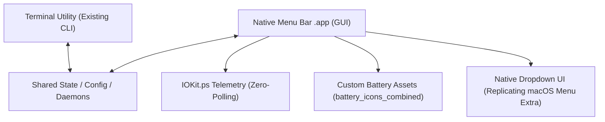

# Architecture & Implementation Blueprint: Native macOS Battery Menu Bar Companion App

## 1. System Overview & Dual-Interface Architecture

This specification defines a native macOS Menu Bar companion application (`.app`) that replaces the default macOS battery menu extra. 

> [!IMPORTANT]
> **Unified Backend Rule**: This application is a native GUI layer that wraps and invokes the **existing working terminal utility** (`bin/macos-opt` / core daemon). It must **not** duplicate, fragment, or conflict with existing logic. All actions, profile toggles, and state mutations must interface through the shared CLI commands, config files, or common IPC/daemon hooks.



---

## 2. Asset Specifications & Dynamic Mapping

Load pre-rendered high-DPI assets located at:
`[battery_icons_combined](file:///Users/gefaass/Desktop/battery_icons_combined/standard/dark/2x/)`

### Geometry & Styling
* **Status Item Canvas**: $25 \times 14\text{ pt}$ ($50 \times 28\text{ px}$ at `@2x`)
* **Inner Fill**: Rounded rectangle capsule ($R = 3.5\text{px}$ @2x, $R = 1.8\text{px}$ @1x) conforming to the border curvature.
* **Color Thresholds**:
  * **$51\% - 100\%$**: 🟢 **Apple Green** (`#30D158` Dark / `#34C759` Light)
  * **$21\% - 50\%$**: 🟠 **Apple Orange** (`#FF9F0A` Dark / `#FF9500` Light)
  * **$\le 20\%$**: 🔴 **Apple Red** (`#FF453A` Dark / `#FF3B30` Light)

### Asset Resolution Helper
```swift
import AppKit

struct BatteryAssetResolver {
    static let baseDir = "/Users/gefaass/Desktop/battery_icons_combined/standard/dark/2x"
    
    static func resolveIcon(percentage: Int, isCharging: Bool, isPluggedIn: Bool, isMissing: Bool = false) -> NSImage {
        let snapped = min(100, max(0, ((percentage + 5) / 10) * 10))
        let filename: String
        
        if isMissing {
            filename = "battery_missing@2x.png"
        } else if isCharging {
            filename = "battery_charging_\(snapped)@2x.png"
        } else if isPluggedIn {
            filename = "battery_plugged_\(snapped)@2x.png"
        } else {
            filename = "battery_\(snapped)@2x.png"
        }
        
        let path = "\(baseDir)/\(filename)"
        if let img = NSImage(contentsOfFile: path) {
            img.size = NSSize(width: 25, height: 14)
            img.isTemplate = false // Preserves green/orange/red dynamic colors
            return img
        }
        return NSImage(systemSymbolName: "battery.100", accessibilityDescription: nil)!
    }
}
```

---

## 3. Real-Time Hardware Telemetry (IOKit.ps Event-Driven)

```swift
import Foundation
import IOKit.ps

final class BatteryMonitor: ObservableObject {
    @Published var percentage: Int = 100
    @Published var isCharging: Bool = false
    @Published var isPluggedIn: Bool = false
    @Published var powerSourceTitle: String = "Battery Power"
    @Published var isLowPowerMode: Bool = false
    @Published var highEnergyApps: [String] = []

    private var runLoopSource: CFRunLoopSource?

    init() {
        refresh()
        registerNotification()
    }

    func refresh() {
        guard let snapshot = IOPSCopyPowerSourcesInfo()?.takeRetainedValue(),
              let sources = IOPSCopyPowerSourcesList(snapshot)?.takeRetainedValue() as? [CFTypeRef] else { return }

        for ps in sources {
            guard let desc = IOPSGetPowerSourceDescription(snapshot, ps)?.takeUnretainedValue() as? [String: Any] else { continue }
            
            if let cur = desc[kIOPSCurrentCapacityKey] as? Int,
               let max = desc[kIOPSMaxCapacityKey] as? Int, max > 0 {
                self.percentage = Int((Double(cur) / Double(max)) * 100)
            }
            
            self.isCharging = desc[kIOPSIsChargingKey] as? Bool ?? false
            if let psState = desc[kIOPSPowerSourceStateKey] as? String {
                self.isPluggedIn = (psState == kIOPSACPowerValue)
            }
            
            if isCharging {
                self.powerSourceTitle = "Power Adapter"
            } else if isPluggedIn {
                self.powerSourceTitle = "Power Adapter (Not Charging)"
            } else {
                self.powerSourceTitle = "Battery Power"
            }
        }
        
        self.isLowPowerMode = ProcessInfo.processInfo.isLowPowerModeEnabled
    }

    private func registerNotification() {
        let context = UnsafeMutableRawPointer(Unmanaged.passUnretained(self).toOpaque())
        runLoopSource = IOPSNotificationCreateRunLoopSource({ ctx in
            guard let ctx = ctx else { return }
            let monitor = Unmanaged<BatteryMonitor>.fromOpaque(ctx).takeUnretainedValue()
            DispatchQueue.main.async { monitor.refresh() }
        }, context)?.takeRetainedValue()

        if let source = runLoopSource {
            CFRunLoopAddSource(CFRunLoopGetCurrent(), source, .defaultMode)
        }
    }

    deinit {
        if let source = runLoopSource {
            CFRunLoopRemoveSource(CFRunLoopGetCurrent(), source, .defaultMode)
        }
    }
}
```

---

## 4. Dropdown Popover UI Specification (Exact macOS Replica)

Replicates the visual layout, spacing, and typography of the native battery popover (`PNG image 3.png`).

```swift
import SwiftUI

struct BatteryDropdownView: View {
    @ObservedObject var monitor: BatteryMonitor
    var onToggleLowPower: ((Bool) -> Void)?
    var onOpenSettings: (() -> Void)?

    var body: some View {
        VStack(alignment: .leading, spacing: 12) {
            // Header: Battery Title, Percentage & Power Source State
            VStack(alignment: .leading, spacing: 2) {
                HStack(alignment: .firstTextBaseline) {
                    Text("Battery")
                        .font(.system(size: 15, weight: .bold))
                        .foregroundColor(.white)
                    Spacer()
                    Text("\(monitor.percentage)%")
                        .font(.system(size: 14, weight: .regular))
                        .foregroundColor(Color(white: 0.65))
                }
                Text(monitor.powerSourceTitle)
                    .font(.system(size: 13, weight: .regular))
                    .foregroundColor(Color(white: 0.55))
            }

            Divider().background(Color.white.opacity(0.12))

            // Energy Mode Section (Low Power Mode Toggle)
            VStack(alignment: .leading, spacing: 8) {
                Text("Energy Mode")
                    .font(.system(size: 13, weight: .semibold))
                    .foregroundColor(Color(white: 0.6))

                HStack(spacing: 10) {
                    Image(systemName: monitor.isLowPowerMode ? "battery.25" : "battery.100")
                        .font(.system(size: 13))
                        .frame(width: 26, height: 26)
                        .background(Circle().fill(Color.white.opacity(0.08)))
                        .foregroundColor(.white)

                    Text("Low Power")
                        .font(.system(size: 14, weight: .regular))
                        .foregroundColor(.white)

                    Spacer()

                    Toggle("", isOn: Binding(
                        get: { monitor.isLowPowerMode },
                        set: { val in
                            monitor.isLowPowerMode = val
                            onToggleLowPower?(val)
                        }
                    ))
                    .labelsHidden()
                    .toggleStyle(SwitchToggleStyle(tint: .yellow))
                }
            }

            Divider().background(Color.white.opacity(0.12))

            // Significant Energy Consumption Section
            VStack(alignment: .leading, spacing: 6) {
                if monitor.highEnergyApps.isEmpty {
                    Text("No Apps Using Significant Energy")
                        .font(.system(size: 13))
                        .foregroundColor(Color(white: 0.5))
                } else {
                    Text("Using Significant Energy")
                        .font(.system(size: 12, weight: .semibold))
                        .foregroundColor(Color(white: 0.6))
                    ForEach(monitor.highEnergyApps, id: \.self) { app in
                        Text(app)
                            .font(.system(size: 13))
                            .foregroundColor(.white)
                    }
                }
            }

            Divider().background(Color.white.opacity(0.12))

            // Footer: Deep Link to System Battery Settings
            Button(action: {
                if let action = onOpenSettings {
                    action()
                } else {
                    let url = URL(string: "x-apple.systempreferences:com.apple.Battery-Settings.extension")!
                    NSWorkspace.shared.open(url)
                }
            }) {
                Text("Battery Settings...")
                    .font(.system(size: 13, weight: .medium))
                    .foregroundColor(.white)
                    .frame(maxWidth: .infinity, alignment: .leading)
                    .contentShape(Rectangle())
            }
            .buttonStyle(.plain)
        }
        .padding(16)
        .frame(width: 300)
        .background(VisualEffectBackground().ignoresSafeArea())
    }
}

struct VisualEffectBackground: NSViewRepresentable {
    func makeNSView(context: Context) -> NSVisualEffectView {
        let view = NSVisualEffectView()
        view.material = .popover
        view.blendingMode = .behindWindow
        view.state = .active
        view.appearance = NSAppearance(named: .darkAqua)
        return view
    }
    func updateNSView(_ nsView: NSVisualEffectView, context: Context) {}
}
```

---

## 5. Seamless CLI / Engine Bridge (`CLIEngineBridge.swift`)

To invoke the existing terminal tool without conflicts:

```swift
import Foundation

struct CLIEngineBridge {
    // Path to existing CLI utility binary
    static let cliPath = "/usr/local/bin/macos-opt" // or bundle resource path
    
    @discardableResult
    static func runCommand(_ args: [String]) -> (output: String, exitCode: Int32) {
        let process = Process()
        let pipe = Pipe()
        
        process.executableURL = URL(fileURLWithPath: cliPath)
        process.arguments = args
        process.standardOutput = pipe
        process.standardError = pipe
        
        do {
            try process.run()
            process.waitUntilExit()
            let data = pipe.fileHandleForReading.readDataToEndOfFile()
            let output = String(data: data, encoding: .utf8) ?? ""
            return (output.trimmingCharacters(in: .whitespacesAndNewlines), process.terminationStatus)
        } catch {
            return (error.localizedDescription, -1)
        }
    }
    
    static func setLowPowerMode(enabled: Bool) {
        // Invokes existing CLI daemon or pmset
        _ = runCommand(["profile", enabled ? "battery" : "balanced"])
    }
}
```

---

## 6. Menu Bar App Delegate & Status Item Controller

```swift
import AppKit
import SwiftUI

@main
struct CustomBatteryApp: App {
    @NSApplicationDelegateAdaptor(AppDelegate.self) var appDelegate
    var body: some Scene {
        Settings { EmptyView() }
    }
}

class AppDelegate: NSObject, NSApplicationDelegate {
    var statusItem: NSStatusItem!
    var popover: NSPopover!
    var monitor = BatteryMonitor()

    func applicationDidFinishLaunching(_ notification: Notification) {
        statusItem = NSStatusBar.system.statusItem(withLength: NSStatusItem.variableLength)
        
        popover = NSPopover()
        popover.contentSize = NSSize(width: 300, height: 240)
        popover.behavior = .transient
        
        let view = BatteryDropdownView(
            monitor: monitor,
            onToggleLowPower: { enabled in
                CLIEngineBridge.setLowPowerMode(enabled: enabled)
            }
        )
        popover.contentViewController = NSHostingController(rootView: view)

        if let button = statusItem.button {
            updateButton(button)
            button.action = #selector(togglePopover(_:))
            button.target = self
        }

        // Periodic icon sync
        Timer.scheduledTimer(withTimeInterval: 5.0, repeats: true) { [weak self] _ in
            guard let self = self, let button = self.statusItem.button else { return }
            self.updateButton(button)
        }
    }

    func updateButton(_ button: NSStatusBarButton) {
        let img = BatteryAssetResolver.resolveIcon(
            percentage: monitor.percentage,
            isCharging: monitor.isCharging,
            isPluggedIn: monitor.isPluggedIn
        )
        button.image = img
        button.imagePosition = .imageLeft
    }

    @objc func togglePopover(_ sender: AnyObject?) {
        if let button = statusItem.button {
            if popover.isShown {
                popover.performClose(sender)
            } else {
                popover.show(relativeTo: button.bounds, of: button, preferredEdge: .minY)
            }
        }
    }
}
```

---

## 7. Info.plist Configuration

```xml
<?xml version="1.0" encoding="UTF-8"?>
<!DOCTYPE plist PUBLIC "-//Apple//DTD PLIST 1.0//EN" "http://www.apple.com/DTDs/PropertyList-1.0.dtd">
<plist version="1.0">
<dict>
    <key>CFBundleIdentifier</key>
    <string>com.user.custombattery</string>
    <key>CFBundleName</key>
    <string>CustomBattery</string>
    <key>CFBundlePackageType</key>
    <string>APPL</string>
    <key>CFBundleShortVersionString</key>
    <string>1.0</string>
    <key>LSUIElement</key>
    <true/> <!-- Headless menu bar agent without Dock icon -->
</dict>
</plist>
```

---

## 14. Implementation Status & Session Learnings (updated)

The blueprint above is implemented and shipped in `byper.app`. Deviations and hard-won constraints discovered during implementation:

### Current feature set (beyond the original spec)
- **Master power slider** (vertical pill, left rail): continuous level, not a binary toggle. Rows fade out chronologically via a two-layer `MasterFadeModifier` (desaturated copy above the knob at a 0.45 floor, full-color below); full-off snapshots state into `PresetSnapshot` and disables everything, full-on restores. Knob uses a spring on upward motion; the rail color interpolates brown→dark-brown (never grey).
- **Presets (Travel / Docked)** with rename (long-press), factory-defaults on fresh activation, and per-mode snapshot capture via a Combine pipeline.
- **Caffeinate** row with IOPMAssertion display-sleep hold + "Auto Enable on Bypass" coupling.
- **Auto Bypass at Threshold** with snooze semantics; polls run in `.common` run-loop mode so triggers fire with menus open or the display asleep.
- **Session Logger** (CSV export to Desktop), **global hotkey** ⌘⌥B, **App Intents** (macOS 13+), **self-updater** prompt on launch.
- Popover background carries a low-level `#782800` wash; master rail enabled color is `#782800`-family.

### Hard-won constraints (do not regress these)
1. **SUID CLI is load-bearing** — non-SUID `byper on` prints success but the SMC write fails silently. Always `chown root:wheel` + `chmod 4755` after copying the bundle.
2. **`scaleEffect` keeps layout size** — any switch scaled to 0.70 needs an explicit `.frame(width:)` clamp (plus offset to re-seat the visual edge) or inline labels (threshold %, transition timer) overflow the row and force text to shrink.
3. **Popover refit subscriptions** — every expandable section flag must feed the `Publishers.Merge` in `AppDelegate` (or use `NSHostingSizingOptions.preferredContentSize` on macOS 13+); otherwise collapse leaves the popover at its expanded height.
4. **Run-loop modes** — `Timer.scheduledTimer` defaults to `.default` mode and stalls while menus track the cursor or the screen sleeps; add to `RunLoop.main` with `.common` for anything that must fire in the background (threshold trigger, status-bar updates).
5. **Minimum OS** — build with `-target arm64-apple-macos11.0` (Makefile) and `LSMinimumSystemVersion: 11.0`; back-deploy shims exist for `tint` (macOS 13), `controlSize` (macOS 12), and `kIOMainPortDefault`/`isLowPowerModeEnabled` (macOS 12).
6. **Bypass engage verification** — `byper on` exit code 0 is not proof; verify via `status` → `state: hold` + `ncr 0x01000000`. A stale `isTransitioning` or same-mode short-circuit in `setPowerMode` can silently swallow toggles; every toggle must issue a real CLI round-trip.
